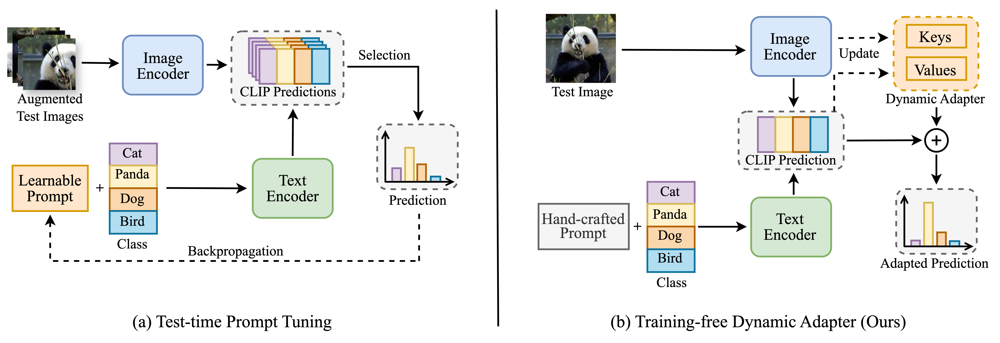

# Efficient Test-Time Adaptation of Vision-Language Models
> [**Efficient Test-Time Adaptation of Vision-Language Models**]()<br>
> [Adilbek Karmanov](https://scholar.google.com/citations?user=R7GNWu0AAAAJ&hl=en), [Dayan Guan](https://dayan-guan.github.io/), [Shijian Lu](https://scholar.google.com/citations?hl=en&user=uYmK-A0AAAAJ&view=en), [Abdulmotaleb El Saddik](https://scholar.google.ca/citations?user=VcOjgngAAAAJ&hl=en), [Eric Xing](https://scholar.google.com/citations?user=5pKTRxEAAAAJ&hl=en)

Official implementation of the paper: "Efficient Test-Time Adaptation of Vision-Language Models" [CVPR 2024].

## Overview

> **<p align="justify"> Abstract:** Test-time adaptation with pre-trained vision-language models has attracted increasing attention for tackling distribution shifts during the test time. Though prior studies have achieved very promising performance, they involve intensive computation which is severely unaligned with test-time adaptation. We design TDA, a training-free dynamic adapter that enables effective and efficient test-time adaptation with vision-language models. TDA works with a lightweight key-value cache that maintains a dynamic queue with few-shot pseudo labels as values and the corresponding test-sample features as keys. Leveraging the key-value cache, TDA allows adapting to test data gradually via progressive pseudo label refinement which is super-efficient without incurring any backpropagation. In addition, we introduce negative pseudo labeling that alleviates the adverse impact of pseudo label noises by assigning pseudo labels to certain negative classes when the model is uncertain about its pseudo label predictions. Extensive experiments over two benchmarks demonstrate TDA’s superior effectiveness and efficiency as compared with the state-of-the-art.

## Main Contributions
In summary, the contributions of this work are threefold: </br>

* **First**, we design a training-free dynamic adapter (TDA) that can achieve test-time adaptation of vision-language models efficiently and effectively. To the best of our knowledge, this is the first work that investigates the efficiency issue of test-time adaptation of vision-language models. </br>
* **Second**, we introduce negative pseudo labeling to alleviate the adverse impact of pseudo label noises which makes TDA more robust to pseudo label noises and generalizable to testing data. </br>
* **Third**, we evaluate TDA extensively over two benchmarks, and experiments show that TDA achieves superior accuracy and efficiency compared with the state-of-the-art. </br>

## Requirements 
### Installation
Follow these steps to set up a conda environment and ensure all necessary packages are installed:

```bash
git clone https://github.com/kdiAAA/TDA.git
cd TDA

conda create -n tda python=3.7
conda activate tda

# The results are produced with PyTorch 1.12.1 and CUDA 11.3
conda install pytorch==1.12.1 torchvision==0.13.1 torchaudio==0.12.1 cudatoolkit=11.3 -c pytorch

pip install -r requirements.txt
```

### Dataset
To set up all required datasets, kindly refer to the guidance in [DATASETS.md](docs/DATASETS.md), which incorporates steps for two benchmarks.

## Run TDA
### Configs
The configuration for TDA hyperparameters in `configs/dataset.yaml` can be tailored within the provided file to meet the needs of various datasets. This customization includes settings for both the positive and negative caches as outlined below:
* **Positive Cache Configuration:** Adjustments can be made to the `shot_capacity`, `alpha`, and `beta` values to optimize performance.

* **Negative Cache Configuration:** Similar to the positive cache, the negative cache can also be fine-tuned by modifying the `shot_capacity`, `alpha`, `beta`, as well as the `entropy_threshold` and `mask_threshold` parameters.

For ease of reference, the configurations provided aim to achieve optimal performance across datasets on two benchmarks, consistent with the results documented in our paper. However, specific tuning of these parameters for negative cache could potentially unlock further enhancements in performance. Adjusting parameters like `alpha` and `beta` within the positive cache lets you fine-tune things to match the unique needs of each dataset.

### Running
To execute the TDA, navigate to the `scripts` directory, where you'll find 4 bash scripts available. Each script is designed to apply the method to two benchmarks, utilizing either the ResNet50 or ViT/B-16 as the backbone architecture. The scripts process the datasets sequentially, as indicated by the order divided by '/' in the script. WandB logging is activated by default. If you wish to deactivate this feature, simply omit the `--wandb-log` argument. 

Below are instructions for running TDA on both Out-of-Distribution (OOD) and Cross-Domain benchmarks using various backbone architectures. Follow the steps suited to your specific needs:"

#### OOD Benchmark
* **ResNet50**: Run TDA on the OOD Benchmark using the ResNet50 model:
```
bash ./scripts/run_ood_benchmark_rn50.sh 
```
* **ViT/B-16**: Run TDA on the OOD Benchmark using the ViT/B-16 model.
```
bash ./scripts/run_ood_benchmark_vit.sh 
```

#### Cross-Domain Benchmark
* **ResNet50**: Run TDA on the Cross-Domain Benchmark using the ResNet50 model:
```
bash ./scripts/run_cd_benchmark_rn50.sh 
```
* **ViT/B-16**: Run TDA on the Cross-Domain Benchmark using the ViT/B-16 model.
```
bash ./scripts/run_cd_benchmark_vit.sh 
```


### Results
#### Comparisons in terms of efficiency and effectiveness on ImageNet
| Method          | Testing Time | Accuracy | Gain   |
|-----------------|:------------:|:--------:|:------:|
| [CLIP-ResNet-50](https://arxiv.org/abs/2103.00020)  | **12min**    | 59.81    | 0      |
| [TPT](https://arxiv.org/abs/2209.07511)            | 12h 50min    | 60.74    | +0.93  |
| [DiffTPT](https://arxiv.org/abs/2308.06038)         | 34h 45min    | 60.80    | +0.99  |
| **TDA (Ours)**  | **16min**    | **61.35**|**+1.54**|

#### OOD Benchmark
| Method            | ImageNet (IN)| IN-A | IN-V2 | IN-R | IN-S | Average | OOD Average |
|-------------------|:--------:|:----------:|:-----------:|:----------:|:----------:|:-------:|:-----------:|
| [CLIP-ResNet-50](https://arxiv.org/abs/2103.00020)    | 59.81    | 23.24      | 52.91       | 60.72      | 35.48      | 46.43   | 43.09       |
| [CoOp](https://arxiv.org/abs/2109.01134)              | **63.33**| 23.06      | 55.40       | 56.60      | 34.67      | 46.61   | 42.43       |
| [CoCoOp](https://arxiv.org/abs/2203.05557)            | 62.81    | 23.32      | 55.72       | 57.74      | 34.48      | 46.81   | 42.82       |
| [Tip-Adapter](https://arxiv.org/abs/2111.03930)       | 62.03    | 23.13      | 53.97       | 60.35      | 35.74      | 47.04   | 43.30       |
| [TPT](https://arxiv.org/abs/2209.07511)               | 60.74    | 26.67      | 54.70       | 59.11      | 35.09      | 47.26   | 43.89       |
| [DiffTPT](https://arxiv.org/abs/2308.06038)            | 60.80    | **31.06**  | **55.80**   | 58.80      | 37.10      | 48.71   | 45.69       |
| **TDA (Ours)**    | 61.35    | 30.29      | 55.54       | **62.58**  | **38.12**  | **49.58** | **46.63**  |

#### Cross-Domain Benchmark
| Method           | Aircraft | Caltech101 | Cars  | DTD   | EuroSAT | Flower102 | Food101 | Pets  | SUN397 | UCF101 | Average |
|-----------------------|:-------:|:----------:|:-----:|:-----:|:-------:|:---------:|:-------:|:-----:|:------:|:------:|:-------:|
| [CLIP-ResNet-50](https://arxiv.org/abs/2103.00020)        | 16.11    | 87.26      | 55.89 | 40.37 | 25.79   | 62.77     | 74.82   | 82.97 | 60.85  | 59.48  | 56.63   |
| [CoOp](https://arxiv.org/abs/2109.01134)                  | 15.12    | 86.53      | 55.32 | 37.29 | 26.20   | 61.55     | 75.59   | 87.00 | 58.15  | 59.05  | 56.18   |
| [CoCoOp](https://arxiv.org/abs/2203.05557)                | 14.61    | 87.38      | 56.22 | 38.53 | 28.73   | 65.57     | 76.20   | **88.39** | 59.61  | 57.10  | 57.23   |
| [TPT](https://arxiv.org/abs/2209.07511)                   | 17.58    | 87.02      | 58.46 | 40.84 | 28.33   | 62.69     | 74.88   | 84.49 | 61.46  | 60.82  | 57.66   |
| [DiffTPT](https://arxiv.org/abs/2308.06038)               | 17.60    | 86.89      | **60.71** | 40.72 | 41.04   | 63.53     | **79.21**   | 83.40 | **62.72**  | 62.67  | 59.85   |
| **TDA (Ours)**                                            | **17.61**| **89.70**  | 57.78 | **43.74** | **42.11** | **68.74** | 77.75   | 86.18 | 62.53  | **64.18** | **61.03**  | 


## Citation

## Contact
If you have any questions, feel free to create an issue in this repository or contact us via email at adilbek.karmanov@mbzuai.ac.ae or dayan.guan@ntu.edu.sg.

## Acknowledgements
Our gratitude goes to the authors of [Tip-Adapter](https://github.com/gaopengcuhk/Tip-Adapter), [TPT](https://github.com/azshue/TPT), and [CoOp/CoCoOp](https://github.com/KaiyangZhou/CoOp) for sharing their work through open-source implementation and for providing detailed instructions on data preparation.
